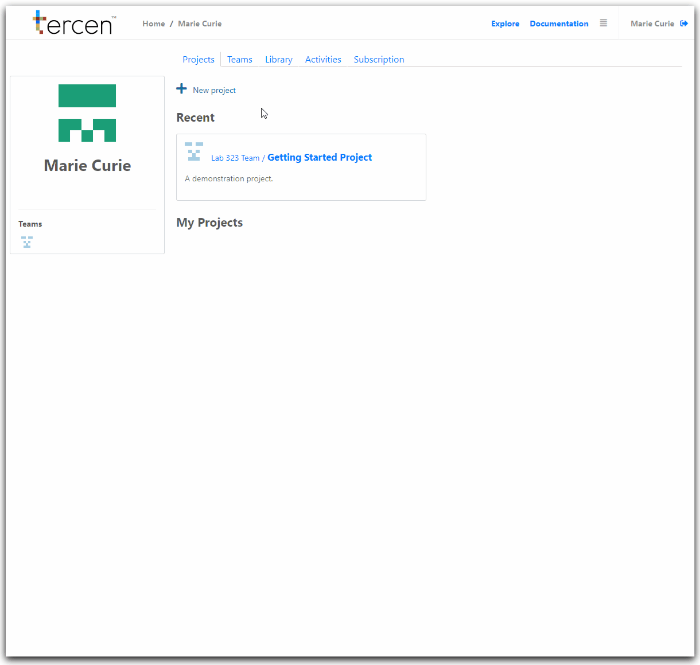

# Create a Crabs team

Before starting this tutorial we recommend you first read our [__Getting Started Guide__](https://tercen.github.io/starters-guide/).

It will help you get familiar with the __Tercen__ interface and introduce you to software concepts which are used in this tutorial.

\

In this section you will create a new team in __Tercen__.

\

Sign-In to __Tercen__.

On your personal home page Click on `Teams`

Click on `+ New team`

Give your team a name (e.g "TheCrabsTeam") in the `Name` tab

Click `OK`

\

<left></left>

\

You have now created a team. 

It is located in your teams list.

\

\

__Next...__ Select an operator for the Team Library.
