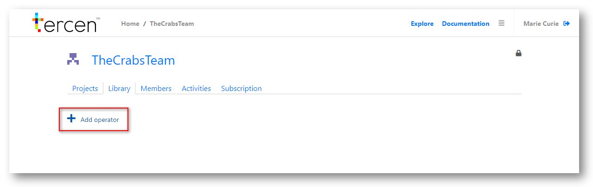
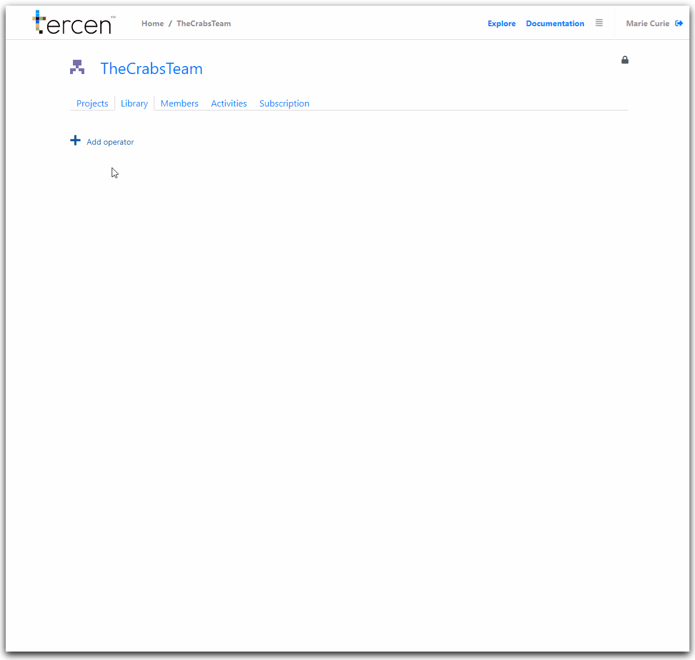

# Install the PCA operator

In this section you will install an operator for the Crabs Team to use.

\

From your personal home page.

\

Click on `Teams`

\

Click on `TheCrabsTeam`

\

Click on `Library`

\

\

Click on `+ Add operator`

\

A list of the operators available in __Tercen__ appears.

\

Select the `PCA` operator

\

Click `OK`

\

The installed operator shows in the `Library` tab

\

\

You have now installed the `PCA` operator for the `TheCrabsTeam` to use in __Tercen__ projects. 

\

\

__Next...__ Start a new project for the team.

