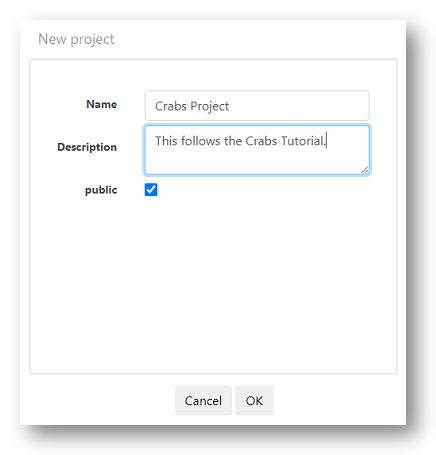

# Create the Crabs project

In this section you will create a project for your team to work on.

\

From your personal home page.

\

Click on the `Teams` tab

Click on your Crab team icom.

You will see the Team home page.

\

\

Click on `+ New project`

Add some information to identify your project.

Decide if it will be made publicly available.

\

\

Click `Ok`

You will now see the home page of your new project.

(Note the Toolbar that contains the main functions for building a project.)

\

\

Button|Description
------|---
__New data set__ |Data files are uploaded here
__New workflow__|Takes you to the workflow builder page
__New file__|Write notes and findings on the project
__Import file__|Upload a supporting document
__Import workflow__|Add a workflow created in another project
__Project Settings__|Change your description or public status

\

\

__Next...___ Upload a data set to your project.