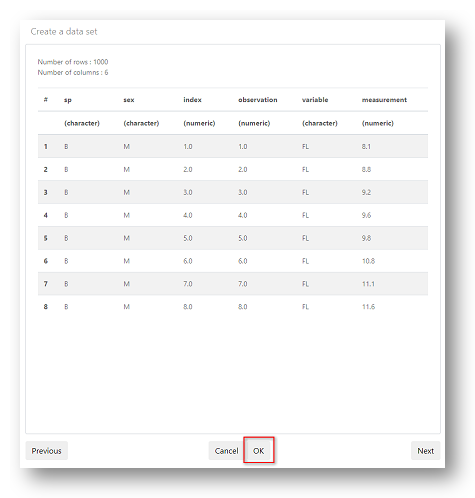

# Upload data

In this section you will copy the provided sample data and upload it to your project.

__Tercen__ accepts data in the following file types.

File|Description
------|---
__.tsv__ |Tab sperated values
__.csv__|Comma seperated values

\

Data can be uploaded in either `wide` format or `long` format.

Most people work in a `Wide` data format. Usually with samples in rows and individual measurements in columns. This is the most typical way we use spreadsheet programs.

For large data sets, with many multiples of measurement criteria, this can become unwieldy. 

It is often necessary to convert from a more "people friendly" `wide` format to a more "machine friendly" `long` format.

__Tercen__ works in `long` format and will convert `wide` format data to long during the upload process.

\

## About the exmple data.

The example data set is available online in a __Tercen__ github repository. 

Right click on this link --> [__Sample File__](https://raw.githubusercontent.com/tercen/crabs_dataset/master/data/crabs_long.csv) and select `Save link as...`

This will download a file to your computer called `crabs_long.csv`

\

__Crab data description:__

\

The data set is called _Crabs_ and it is in a _long_ format. 

The file contains 1000 measurements of crab physical traits. 

Data is recorded under six headings (called __factors__).

\

Factor|Description
------|---
sp |species, __B__ (Blue Crab) or __O__ (Orange Crab) 
sex|__M__ (Male) or __F__ (Female)
index|index 1 to 50 within each of the four groups (2 sex and 2 species)
variable|Five crab physical traits can be measured `FL`, `RW`, `CL`, `CW` and `BD`
measurement| the value in mm of the `variable`
observation| index 1 to 200 observations for each variable

\

__Crab variable descriptions__

`FL` (frontal lobe size)\
`RW` (rear width)\
`CL` (carapace length)\
`CW` (carapace width)\
`BD` (body depth)\

\

## Upload a data file

From your crabs projects home page. 

\

\

Click `New data set`

\

A dialog window will open.

Here you can give your data a name (e.g.`Crab data`)

Click on `Choose File`, browse to your file location and select it.

Leave the defaults for encoding, separator, and quote types.

Click `Next`

\

\

__tercen__ will display the column headers (factors) from your file and the data type (e.g character, numeric) it has detected in the rows.

\

\

Click `OK`

\

_(The `Next` button will take you to the `wide to long`conversion wizard. This isn't necessary as the crabs sample data is already in long format.)_

\

You will now see the new data set listed on the project home page.

\

\

You have successfully uploaded the sample data to __Tercen__. 

\

\

__Next...__ create a new workflow.