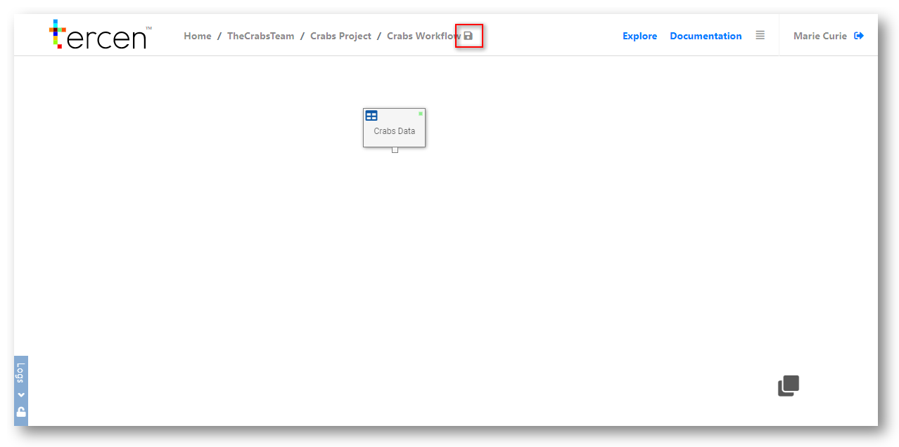

# Create a workflow

In this section you will create a workflow for your project.

\

From your Crabs Project home page

Click on `New workflow`

\

\

Name the workflow (e.g. "Crabs workflow")

Click `OK`

\

\

You will be taken to the empty workflow builder screen.

It is titled "Crabs workflow".

We will now add a workflow step

The first step to any workflow will be the Data Table that was uploaded.

\

__Add a step to a workflow__

Right click the workflow builder screen.

Select `Add`

Click on `Table`

Select the Crab data

Click on `OK`

You will see a box called `Crabs Data` created on your workflow.

You have now successfully imported the crabs data set into the projects workflow.

(Note that it shows the `Table` icon in the top left corner.)

\

\

\

The box that you added to the workflow is called a __step__ 

Steps are the fundamental building blocks of a data analysis process.

Right click a step and the `long menu` appears.

The following actions can be performed on a step from the long menu.

\

Action|Description
------|---
__Reset__ |Clears any calculations performed on the data.
__Open__|Takes you to the projection page of the step.
__Rename__|Change the step name to something more descriptive.
__Remove__|Delete this step.
__Duplicate__|Copy the step to make a differant visualisation.
__Add__| Create a new step which will use the outputs from this step.

\

__Saving Workflows__

As you make changes to a workflow and perform calculations __Tercen__ will prompt you to save your work by displaying a disk icon beside the name of the workflow.

It is recommended you save your work often.

\

\

\

\

__Next...__ make a visual projection of your data.
