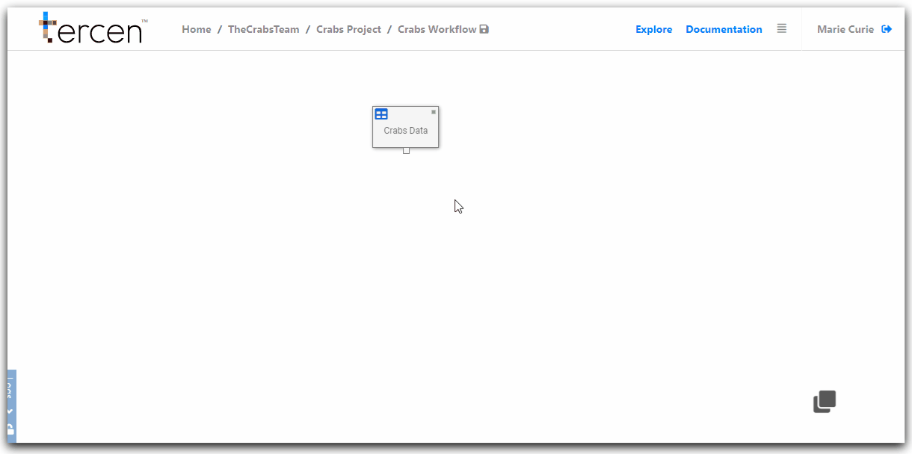
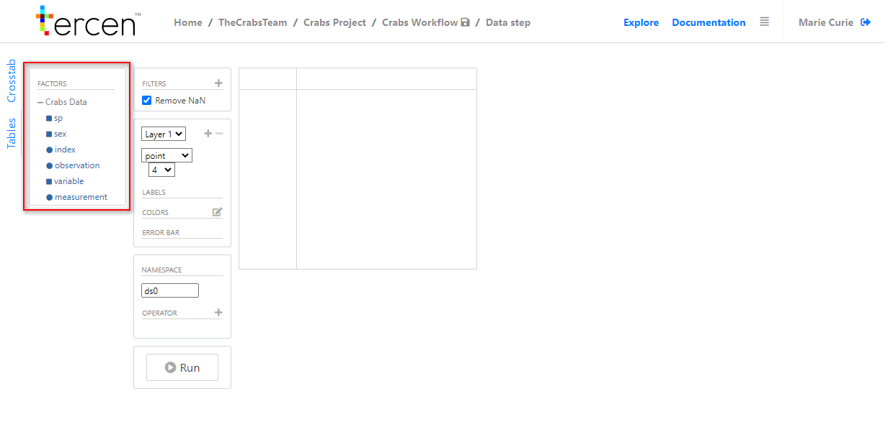
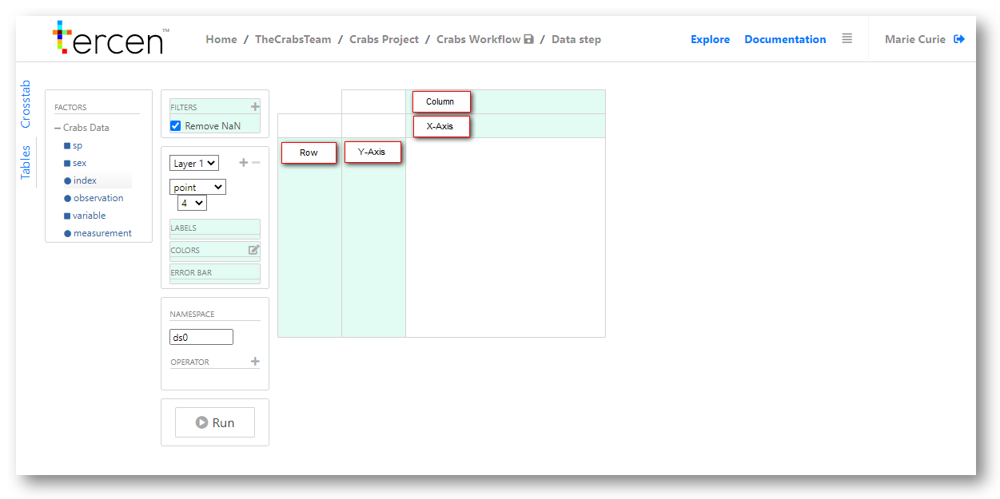
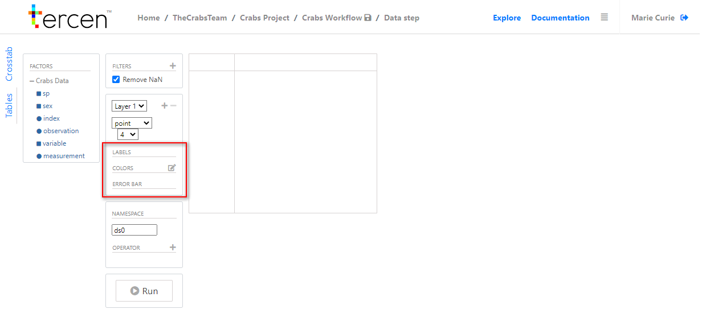

# Data projection and visualisation.

In this section we will...

Add a data analysis step to our workflow.

Review the projection screen.

Assign factors to make a projection of the data.

Visualize our projection as a Heatmap.

\

__Add an analysis Data Step__

Right click on the Data Table step to bring up the long menu.

Click `Add`

Select Data Step

Click `Ok`

You will be taken to the __Projection Screen__

\

\

__Understanding the Projection Screen__

The projection screen is made up of zones which display data or allow it to be manipulated.

The first two to understand are the __factors__ list and the __projection grid__.

Factors are the individual categories of your data which can be manipulated into a visualisation. 

They can be the data you uploaded or the results of a computation performed on it.

Click on the `+` icon beside `Crabs Data`

You will see the __factors__ listed are the headers of the sample data file we uploaded.

\

\

__The Projection Grid__

The projection grid is where visualisations are created and displayed.

There are four divisions to the projection grid.

__X-Axis__\
__Y-Axis__\
__Column__\
__Row__\

\

\

By adding factors to these zones a projection is created and visualisations can be made of it.

Factors are added by drag-and-drop from their list.

\

__Definition Controls__

In the central tab of the projection screen is the definitions zone.

This is where factors can be dragged and dropped to configure how data is represented on the visualisation.

\

\

Zone|Description
------|---
__Label__ |Define which factor provides additional detail to data
__Colours__|Control vistaulisations by assigning colours to values
__Error Bar__|an error bar

> Help needed here

\

__Make a projection of the Crabs Data__

Drag and drop factors to zones on the projection grid as follows.

`observation` to __column__\
`measurement` to __y-axis__\
`variable` to __row__\

Re-size your visualisation by grabbing the grid lines and dragging them closer together.

\

\

Notice, the `variable` __factor__ is the row and the `observations` are the columns.

Unless specifiec otherwise by you __Tercen__ with sort data from low to high values.

> Need help on decription line. What has happened here?

\

__Configure the data visualisation as a Heatmap__ 

By changing control settings the data projection can be visualised on different ways.

Drag and drop the `Measurement` factor to the `Colors` zone.

> Explaination line here.

Change the visualisation setting from `point` to `heatmap`. 

\

\

Congratulations, you have created your first heatmap visual. 

\

\

__Next...__ analyze the data by performing a __PCA__