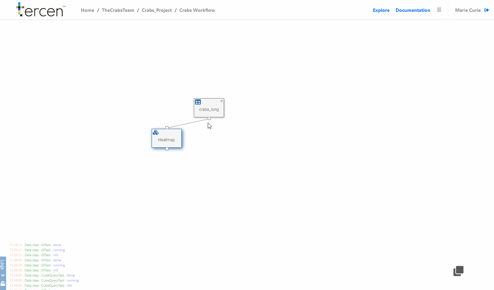

# Multi-group pairwise visualisation

In this section you create a multi-group pairwise visual of the raw data.

This technique puts the same factor (`variable`) on the row and column zone.

The resulting view is a powerful tool for data visualization.

\

__Add a data step__

From the workflow builder screen.

Click on the `Table` data step 

Select `Add` 

Choose `Data step`

The projection screen will open.

Drag and drop the following factors into the grid...

\

`measurement` to __Y-Axis__\
`variable` to __column__\
`variable` to __row__\
`observation` to __labels__\
`Color` to __colors__\

\

Re-size the projection by dragging the grid lines tighter. 

\

You have now visualized a multi-group pairwise projection.

The crab characteristics are compared to each other and the suspected species (color) are split in the cells for comparison.

\

\

Remember to return to the Workflow Builder and rename the step to "Multi Pairwise"

You can drag it into position to make it more view-able.

\
__Further Divide Groups__

Drag and drop these factors.

\

`sex` to __column__\

\

\

You have now sub-divided your multi-group comparison by sex.

\

__Next...__ make a PCA calculation of the data.

