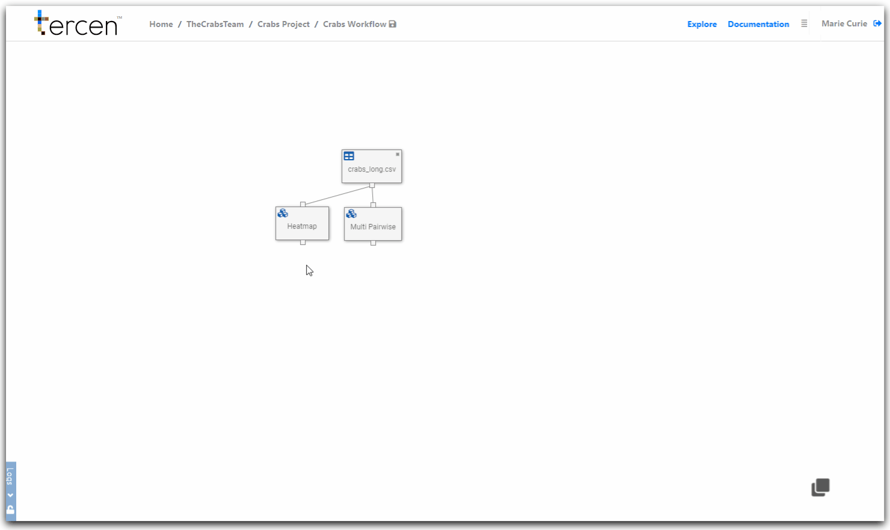

# Add the PCA Operator

As we saw in the previous chapters data projections can be visualized in various ways.

They can also have computations performed on them.

The results of these computations are "new data" that becomes available for further visualisations.

Visualization of new data is done in later steps of the workflow.

In this Chapter you will perform a Principle Component Analysis on the sample Crabs data.

\

__Add the PCA Operator to the projection__

The projection screen has a __zone__ where Operators are added.

\

\

\

Click `+` 

Select  the `PCA` operator 

_(Recall that you previously added this to the Library in Chapter 3)_

Click on `Run` to activate the operator

Don't forget to save your workflow.

\

\

A PCA has now been calculated on the data.

Another data step will be needed to view it's results.

\

__Managing Steps on the Workflow Screen__

It is important to take the time to label steps correctly.

This organizes your workflow in ways it can be easily understood.

Return to the workflow page

Right click on your data step

Choose `Rename` and type "PCA" to identify this step.

A green dot appears in the top right corner.

This is to tell you that the calculation has been performed.

You can clear your calculations, or re-run them, using the long menu.

Steps can be dragged into new positions to make your workflow more readable.

\

__Next...__ visualise the results of the PCA computation.