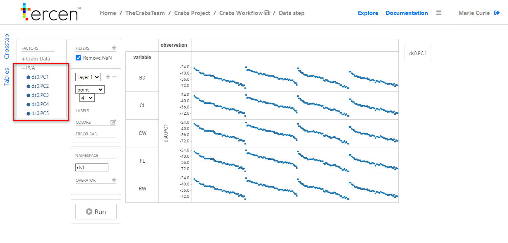
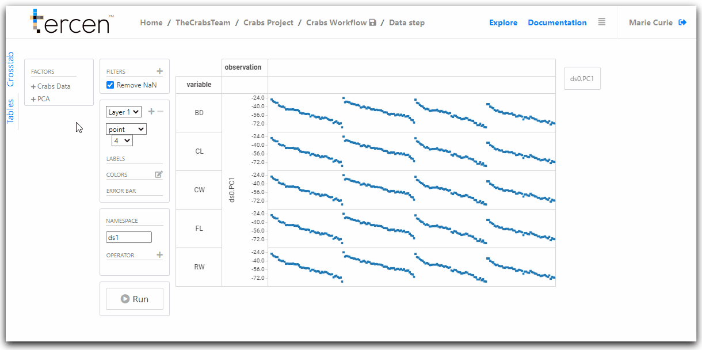
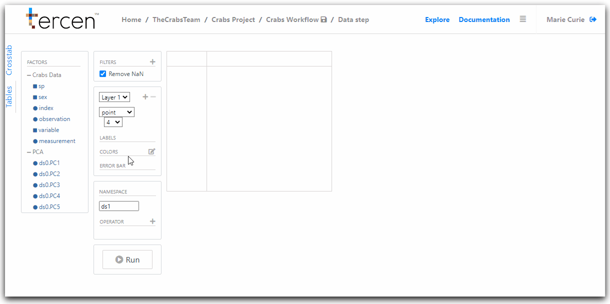
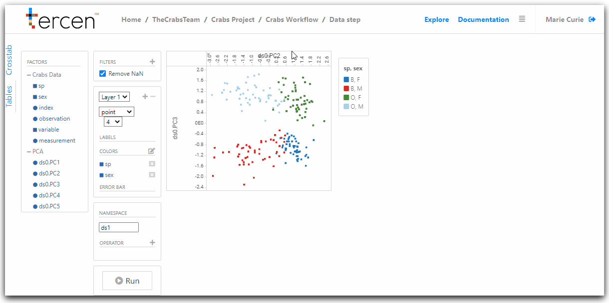

# Visualize the results of the PCA

Computations made in a data step can become the inputs to data steps that are attached to them in the workflow.

In __Tercen__ both the original data, and the computation results, are passed to the "child" step.

In this Chapter we will visualize the output of the PCA computation. 

We will use two of the results  (Principal Components) in a pair-wise plot. 

\

__Add a new data step__

from the workflow builder screen.

Right Click on the `PCA` data step to access the long menu

Select `Add`

Choose `Data Step`

The projection screen will open.

You will see it is a copy of the "parent" data step `PCA` with a new set of __factors__

The new factors are the results of the PCA computation.

They are the Principle Components and are labeled PC1 to PC5.

PCs are a number of uncorrelated variables, a score, to identify clusters.

Click the `+` icon to view the new list of factors.

\

\

__Use PCA results in a new visualisation__

To create a new visualisation we must first remove the previous one.

Click the small `X` which appears in the corners of the projection grid divisions.

The resulting view should be an empty projection

\

\

To create the a new pair-wise projection drag and drop the following factors:

\

PCA `ds0.PC2` to `X-Axis`\
PCA `ds0.PC3` to `Y-Axis`\
Crabs Data `sex` to `Colors`\
Crabs Data `sp` to `Colors`\

\

Save the workflow.

This creates a visualisation of the PCA results (PC2 and PC3) in a pairwise plot.

It is color coded to show the main sex/species groupings.

\

\

Return to the workflow builder screen to rename your data step.

\

\

\

__Next...__ gather the PCA results to use them in a multi-group pairwise projection.
