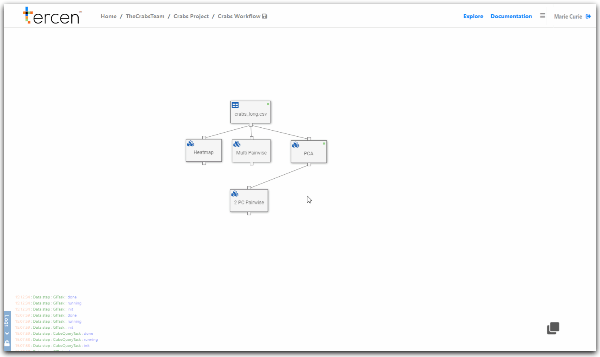

# Add a Gather Step

Some calculations require data to be in a long format to work.

In this section we perform a gathering of the Principal Components.

by gathering the principal components we can then use them in a block for a visualization

This gather is done so a multi-pairwise comparison can be done with the PCA results.

\

__Add a gather step to a workflow__

From the Crabs workflow builder screen.

Right-click on `PCA` and select `Add`

Select the `Gather` Step

It will appear on top of the `PC2 vs PC3` step. 

Re-position it in the workflow.

\

\

Right click on the `Gather` Step and select `Edit`

In `Namespace` enter "PCA" to indicate where the data came from.

In `Selection Pattern` enter ds0 to filter-select the PCA results.

Click the `Crabs Workflow` link to return to the workflow builder screen.

Right Click the `Gather` step and select `Run`

Save the workflow

\

The gather step is now configured.

\

\

__Next...__ create a pairwise plot of the gathered principle components.