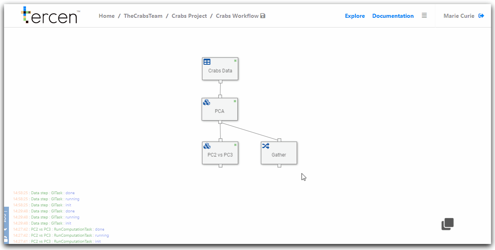
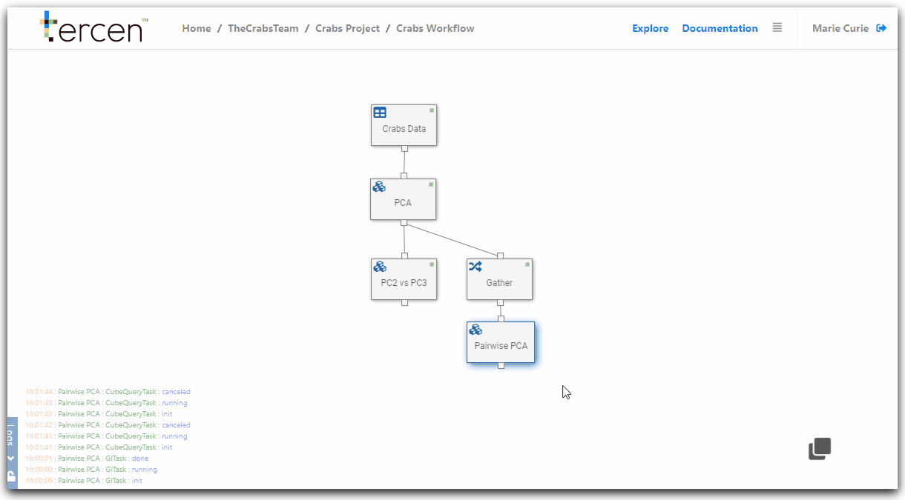

# Visualize gathered PCA results

In this section you create a pairwise visual of the Principal Components collected in the `Gather` step.

\

__Add a new data step__

From the workflow builder screen.

Right Click on the `Gather` data step

Select `Add` 

Choose `Data step`

This will create a new child step.

Rename the new `Data step` to "Pairwise PCA"

Right Click `Pairwise PCA`

Select `Edit`

Clear the projection grid by clicking `X`

Save your workflow

\

\

__Create a pairwise projection of the principle components__ 

Drag and drop the following factors to the projection grid zones.

\

`PCA.value` to __y-axis__\
`PCA.variable` to __column__\
`PCA.variable` to __row__\
`observation` to __labels__\
`sp` to __Colors__\
`sex` to __Colors__\

\

Re-size the grid lines to make the projection view-able

Save the workflow

Color is used to indicate what data point belongs to a female or male (gender is an observation) crab specimen.

Placing `Observation` on `Label` separates the data points into individual crabs so they can be plotted.

\

You have created a pairwise projection of all the Principal Components. 

\

\

\

__Next...__ you will create a multi-pairwise projection of the Crabs data.