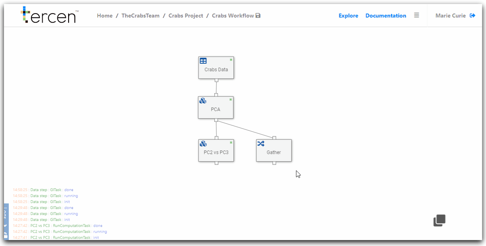

# Visualize gathered PCA results

In this section you create a pairwise visual of the Principal Components collected in the `Gather` step.

All Principal Components will be plotted against each other in a multi-pairwise visualization.

\

__Add a new data step__

From the workflow builder screen.

Right Click on the `Gather` data step

Select `Add` 

Choose `Data step`

This will create a new child step.

Clear the projection grid by clicking `X`

\

\

__Create a pairwise projection of the gathered Principle Components__ 

Drag and drop the following factors to the projection grid zones.

\

`PCA.value` to __y-axis__\
`PCA.variable` to __column__\
`PCA.variable` to __row__\
`observation` to __labels__\
`Color` to __Colors__\
`sex` to __Colors__\

\

Putting two factors on Color combines them to indicate the crab specimens by their groups. (Orange Male, Blue Female etc).

Placing `Observation` on `Label` separates the data points into individual crabs so they can be plotted.

Re-size the grid lines to make the projection view-able

\

Save the workflow

Rename the new `Data step` to "Multi PC Pairwise"

\

You have created a pairwise projection of all the Principal Components. 

\

\

__Next...__ create an export step for the PCA results.