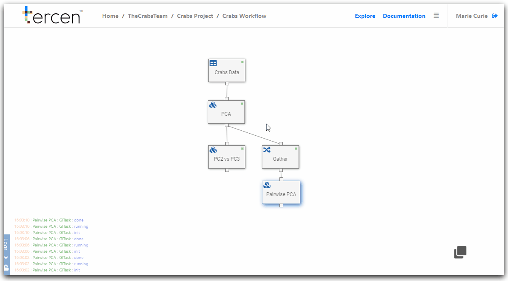
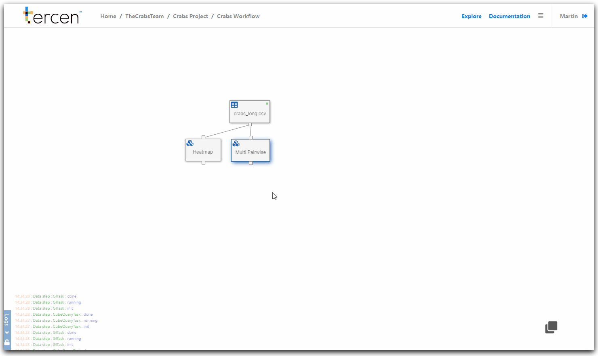
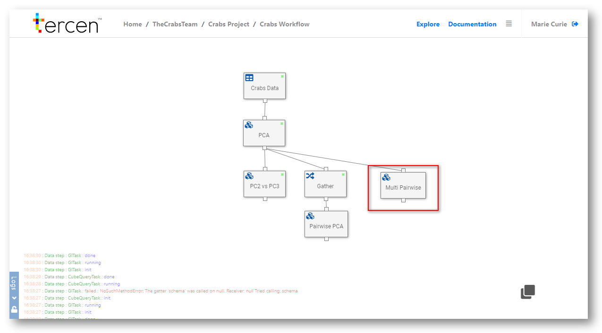

# Multi-group pairwise visualisation

In this section you create a multi-group pairwise visual of the PCA calculation.

This technique puts the same factor (`variable`) on the row and column zone.

The resulting view is a powerful tool for data visualization.

\

__Add a data step__

From the workflow builder screen.

Click on the `PCA` data step 

Select `Add` 

Choose `Data step`

The projection screen will open.

Clear the projection grid by clicking `x` on the zones.

Drag and drop the following factors into the grid...

\

`measurement` to __Y-Axis__\
`variable` to __column__\
`variable` to __row__\
`index` to __labels__\

\

Re-size the projection by dragging the grid lines tighter. 

You have now created a pairwise projection of the `variable` factor.

\

\

__Convert to Multi-Group pairwise__

Drag and drop these factors.

\

`sp` to __column__\
`sex` to __colors__\

\

\

You have now visualized a multi-group pairwise projection. 

\

Remember to return to the Workflow Builder and rename the step to "Multi Pairwise"

You can drag it into position to make it more view-able.

\

\

\

\

__Next...__ make the results of a computation exportable.

