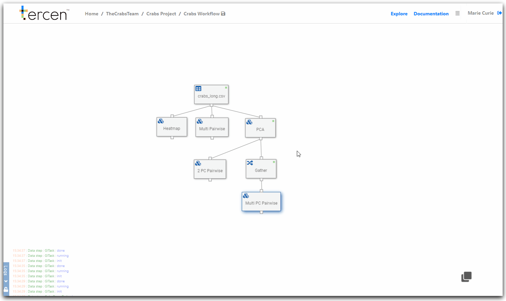

# Export your computations results

In this section you will export the results of the PCA operator computation to a download-able file.

The file is a new __tercen__ table which can be imported to other projects.

\

__Create and Export Step__

From the workflow builder screen.

Right click on the `PCA` step

Select `Add`

Choose `Export`

Drag the new export step to the right

Right click on the `Export` step

Select `Run`

Save the workflow

Click on "Crabs project" on the link path.

You will see the data has been made available on the project page.

It can be downloaded from here with the export icon.

\

\

\

__Next...__ further learning steps.
