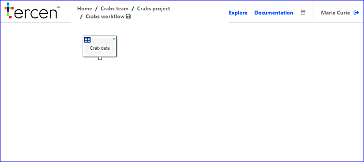

# Save the Crabs workflow

> Should be part of the previous chapter and use pointer or .gif to show the save icon in the path

Click on the "save icon" besides the \\crabs workflow, the workflow is now saved.

