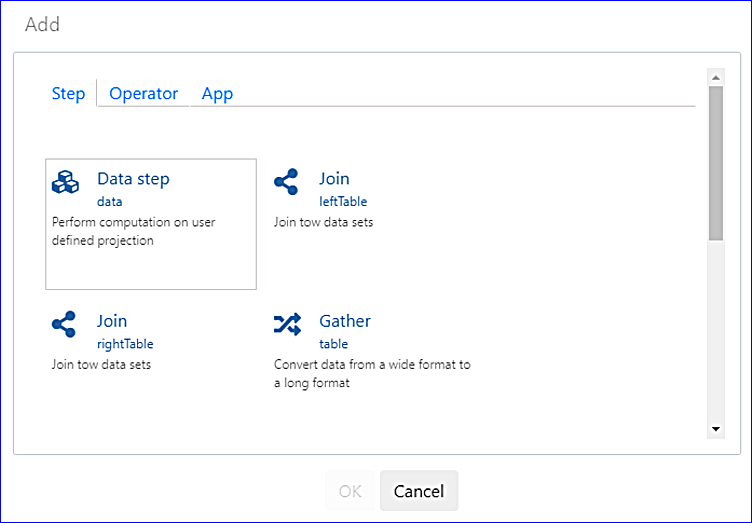
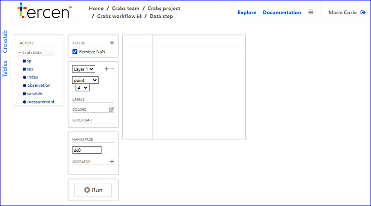
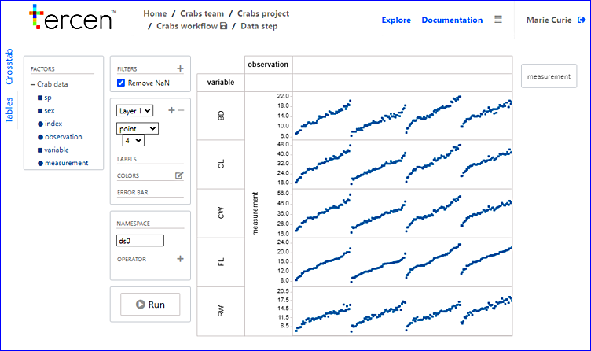

# Define a Heatmap view

> same text as define a heatmap view?

In this section you visualize your data using __projections__.

* Right click on the `Crab data` __step__ and select `Add`

* Click on `Data step`

\

A __projection__ page opens.

* Click on + left of the crab data to show a the available factors

> Under `Factors` click the plus icon beside your data name. You will now see all of the headers to your data.

  
The __projection__ is composed of different _zones_. The _zones_ descriptions are described in the image below:

> No labels on this image. Need to clearly define and name the zones to prevent confusion with next steps.

\

You can create any __projection__ of the data by dragging-n-dropping a _factor_ to one of the _zones_. There are four _zones_ to create a table and three on the left to provide details.

> Zones need to be better explained with images showing exactly where they are and which zone is which.
On the right are:

* _y-axis zone_
* _x-axis zone_
* _column zone_
* _row zone_

On the left are:

> image needed with pointers to show better where these are. Could also have a decription of their functionality to help understand them.

* _label zone_
* _colors zone_
* _error bar zone_
\
\

* Drag-n-drop the ``measurement`` factor to the _y-axis zone_
* Drag-n-drop the ``variable`` factor to the _row zone_
* Drag-n-drop the ``observation`` factor to the _column zone_

You now have the following image:

> image missing

Notice, the `variable` __factor__ is the row and the `observations` are the columns.

Re-size the image to make the projection viewable

* Place the mouse on the row lines and drag them closer.
* Place the mouse on the column lines and drag them closer.

The re-sized image looks like:

\

> Feel we could explain the meaning of this.

> feel we could introduce the Heatmap better here and explain why you are following these steps.

* Drag-n-drop the "Measurement" __factor__ to _colors zone_
* Select `heatmap` in the drop down menu where it currently says `point`. 

The projection window now look like:

Congratulations on your first heatmap visual. 

In the next section you analyze the data by performing a __PCA__.