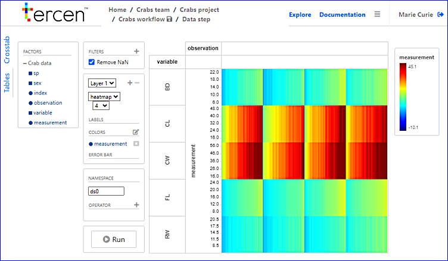

# Running a PCA

In this section you perform a PCA on the data.

>stronger introduction needed.

The projection you created in the previous section can also be used by a computation (i.e. __operator__).

This is due to the _What you see is what you compute_ paradigm. 

First we add the PCA operator.

Continue in the projection we created in the previous chapter.

* Click on the `+` on the right side of the `OPERATOR` tab

> red box on image or .gif. 

* Select  the `PCA` operator

\

* Click on `RUN` to activate the operator

* Click on the save icon beside the `Crabs workflow`

* Go back to the crabs workflow page by clicking on it

The operators in every step can also be activated from the workflow page by right clicking on the data step and selecting `Run`
The the data step status is indicated by the color on the top right corner, red means not activated and green means activated.

> I don't see any red status icon when I use it. 

* Right click on the data step and select `Rename`

* Always name the steps descriptive to keep a clear workflow.

> This sentence above previous sentence

* Rename to "PCA" 

The steps in the workflow can be dragged to your liking. Try to keep your workflow easily interpretable.

* Drag the "PCA" step around

* Save the entire workflow by clicking on the save icon

You have computed a PCA on the data. In the upcoming sections we take a look at the results of the PCA. 

> This is where I ask about assumed knowledge of the user. Do they know what a PCA is? we pressed some buttons but nothing visible happened on screen. Should there be a description of the results of "running a PCA".