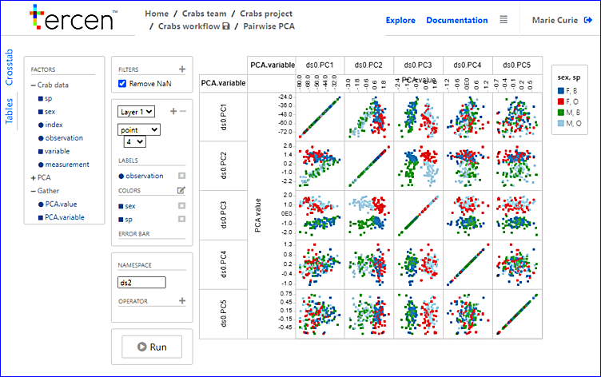

# Visualize a pairwise PCA
In this section you create a pairwise visual of all Principal Components.

* Click on the `Gather` data step and select `Add` 

* Choose a `Data step`
* Rename `Data step`to `Pairwise PCA`

\

* Doubleclick `Pairwise PCA`
* Clear the projection so that it will be completely emtpy

\

* Drag-n-drop the ``PCA.value`` factor to the _y-axis zone_
* Drag-n-drop the ``PCA.variable`` factor to the _column zone_
* Drag-n-drop the ``PCA.variable`` factor to the _row zone_
* Drag-n-drop the ``observation`` factor to the _label zone_
* Drag-n-drop the ``sp`` factor to the _Colors zone_
* Drag-n-drop the ``sex`` factor to the _Colors zone_

Re-size the image to make the projection viewable
* Place the mouse on the row lines and drag them closer.
* Place the mouse on the column lines and drag them closer.

\

* Save the workflow

You have created a pairwise projection of all the Principal Components. Next you will create a multi-pairwise projection of the Crabs data.