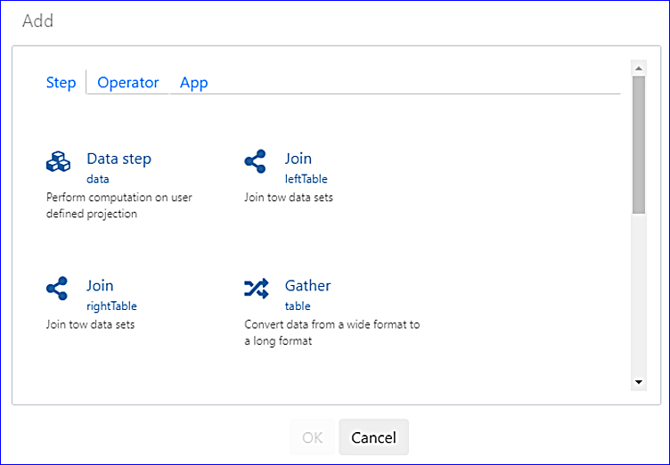
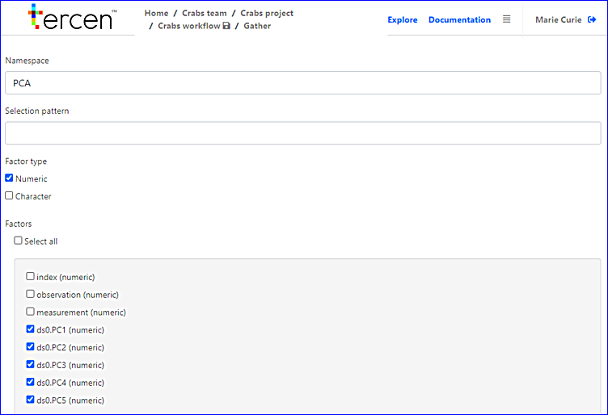
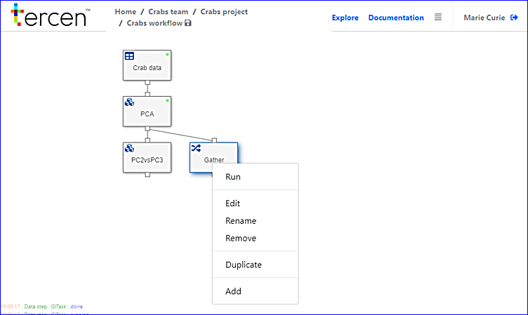

# Gathering the PCA results

> This chapter before last chapter.

In this section we perform a gathering of Principal components.

> Maybe explain what a Gather is and why use it.

* Go to the Crabs workflow

* Right-click on `PCA` and select `Add`
* Select `Gather`

\

The `Gather` __step__ will appear on top of the `PC2vsPC3` __step__

* Drag the `Gather` step to the right

\

* Doubleclick on `Gather`
* Enter "PCA" in the `Namespace`
* Select all the Principal Components

> Explain what the elements of this screen are and do?

\

* Click on `Crabs workflow`
* Right click on `Gather` and select run

\

* Save the workflow

We have gathered Principal components. 

In the upcoming sections we take a look at creating a pairwise plot of all the principle components.