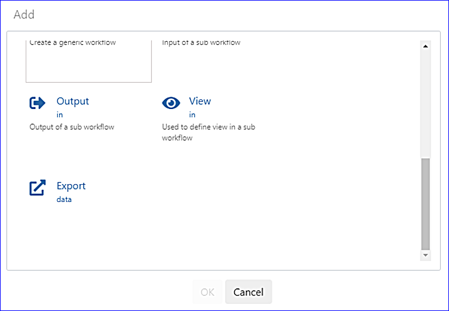
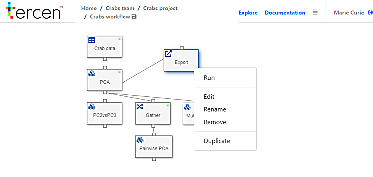
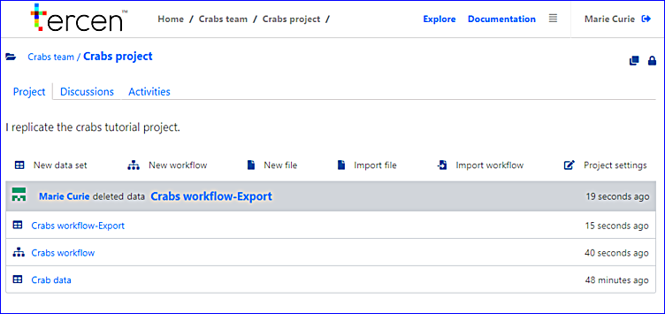

# Export PCA results

In this section you export the results to a downloadable file. 

Head over to the Crabs workflow.

* Right click on the `PCA` step and choose `Add`

* Select `Export'

\

* Drag the export __step__ to the right

* Right click on the `Export` step and select `Run`

\

* Save the workflow

It has now been activated, showing a green status. 

* Go to the "Crabs project" page by clicking it on the top bar

The data has been exported to the project page.

\

You can download the data by clicking the download icon beside it. It is also available as a __Tercen__ **Table** (i.e. data set) and can be used by other workflows.
